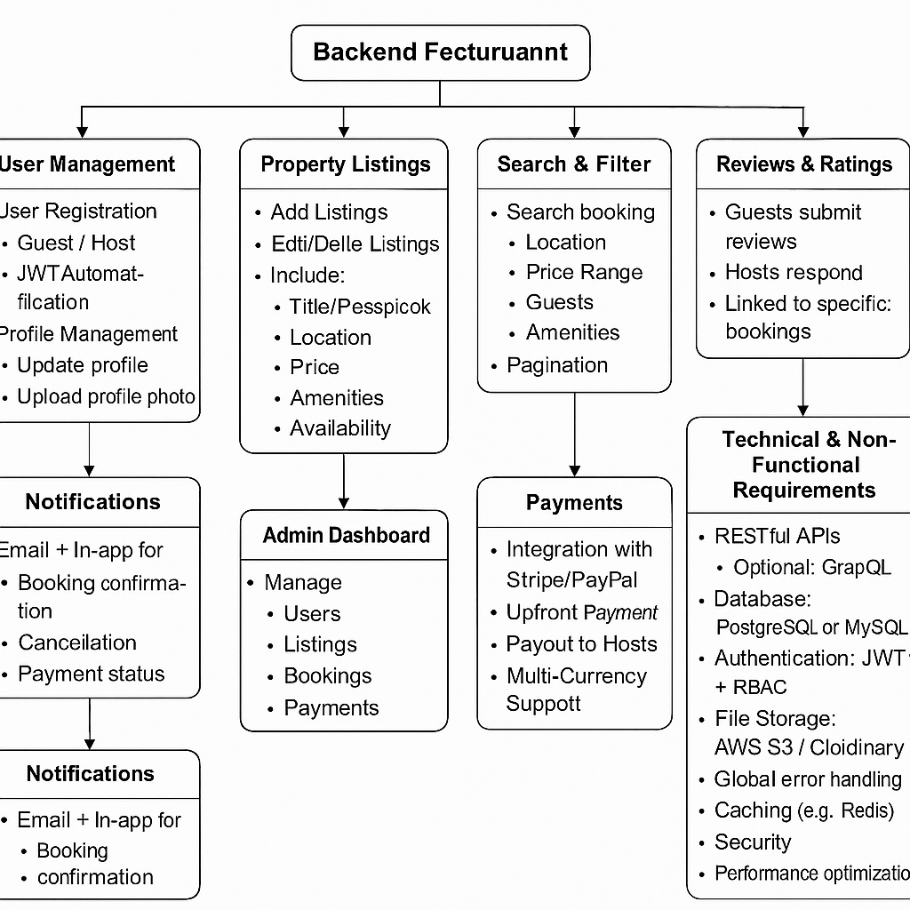

# Airbnb Clone - Backend Features & Functionalities

This document outlines the backend system's major components and responsibilities for the Airbnb Clone project.

## 📌 Diagram
The diagram below illustrates how core features are grouped and how they interact within the system.

---

## 🔑 Core Features

### 1. User Management
- Guest & Host Registration (JWT Authentication)
- OAuth Login (Google, Facebook)
- Profile photo upload, contact info, preferences

### 2. Property Listings
- Hosts can create, update, or delete listings
- Includes: title, location, price, availability, amenities

### 3. Search & Filter
- Filter by: location, price, guests, amenities
- Pagination for large result sets

### 4. Booking System
- Guests can book available listings
- Prevent double-bookings
- Manage status (Pending, Confirmed, Cancelled)

### 5. Payments
- Integration with Stripe/PayPal
- Guest upfront payments, host payouts
- Supports multiple currencies

### 6. Reviews & Ratings
- Guests leave reviews linked to completed bookings
- Hosts may respond to reviews

### 7. Notifications
- Email and in-app alerts for bookings, cancellations, payments

### 8. Admin Dashboard
- Monitor and manage: users, listings, bookings, and payments

---

## 🛠️ Technical Requirements

- RESTful API with optional GraphQL
- PostgreSQL or MySQL database
- JWT Authentication + Role-Based Access Control
- File storage (property images, profile photos)
- Third-party services (SendGrid, Mailgun)
- Error handling, logging, security, rate limiting
- Caching (e.g. Redis) and test automation
