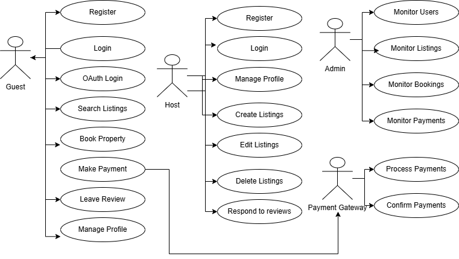

# Use Case Diagram

This document provides a **Use Case Diagram** for the backend system of the **Airbnb Clone Project**. It illustrates how different types of users interact with the system and highlights the core features implemented.

## 🎯 Purpose

To visualize system interactions between the following actors and the Airbnb system:
- **Guest**
- **Host**
- **Admin**
- **Payment Gateway** (external system)

## 👥 Actors and Their Use Cases

### 🧍 Guest
- Register
- Login
- OAuth Login
- Search Listings
- Book Property
- Make Payment
- Leave Review
- Manage Profile

### 🧍 Host
- Register
- Login
- Manage Profile
- Create Listing
- Edit Listing
- Delete Listing
- Respond to Review

### 🧍 Admin
- Monitor Users
- Monitor Listings
- Monitor Bookings
- Monitor Payments

### 🔗 Payment Gateway (External)
- Process Payment
- Confirm Payment

## 🖼️ Diagram

The diagram below visually maps these actors to their respective system interactions:

---

This diagram was created using [Draw.io](https://draw.io) and is stored in this directory as `airbnb-use-case-diagram.png`.

